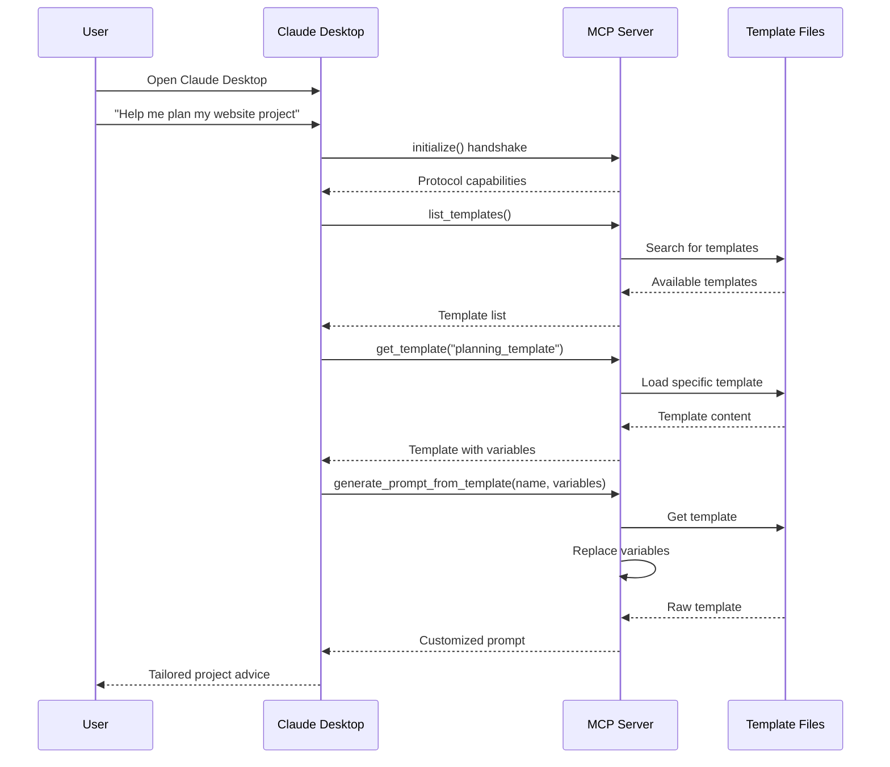

# 🚀 Project Management Assistant with Claude

👋 Hey! Welcome to this MCP server implementation that transforms Claude into a specialized project management assistant using parameterized templates.

## 💡 What's This Project?

This project connects Claude Desktop to a local Model Context Protocol (MCP) server that provides specialized project management templates. By leveraging these templates, Claude can offer tailored project management advice across multiple domains:

- Project planning and scope definition
- Risk assessment and mitigation
- Team collaboration and stakeholder management
- Progress tracking and reporting
- General project management queries

## 🔄 How It Works - Architecture



## 🧠 My Implementation Approach

I implemented this MCP server with key focuses on reliability and compliance with the protocol. Here's what I did:

1. **Strict I/O Separation** - The most critical part was ensuring proper JSON-RPC message handling. Every message between Claude and the server must be well-formed JSON. I used file descriptor manipulation in the shell script to keep stdout clean for pure protocol messages.

2. **Proper Protocol Handshake** - The server correctly implements the initialize handshake method required by Claude Desktop. This establishes capabilities and protocol version compatibility.

3. **Error Isolation** - All logging and error messages are redirected to stderr or log file, never to stdout. This prevents Claude from trying to parse non-JSON text.

4. **DRY Principle** - The server reuses existing templates from the parent directory rather than duplicating them, maintaining consistency across implementations.

## 🛠️ How to Run This Project

1. **Start the MCP server:**

   ```bash
   ./run.sh
   ```

   This script:
   - Creates a virtual environment in the BUILD_WITH_AI directory
   - Installs required dependencies from `requirements.txt`
   - Launches the MCP server with strict I/O controls

2. **Connect Claude Desktop to your server:**

   1. Open Claude Desktop
   2. Go to Settings → Developer
   3. Enable MCP
   4. Add a new server with:
      - Name: "Project Manager"
      - Command: "/opt/homebrew/bin/bash"
      - Args: ["/full/path/to/run.sh"]
   5. Save settings

   > **Note:** Do NOT use the HTTP JSON-RPC URL option. The server uses stdio transport as required by the MCP protocol.

3. **Start using project management templates in Claude**

## 📚 Available Templates

All templates are located in `../source_code/prompt_templates/` and include:

- `system_prompt_template.md` - Base template establishing Claude's role as a PM consultant
- `planning_template.md` - For project planning, scope definition, and scheduling
- `tracking_template.md` - For progress tracking and status reporting
- `risk_template.md` - For risk identification and mitigation strategies
- `collaboration_template.md` - For team collaboration and stakeholder management
- `general_query_template.md` - For general project management queries

## 🔧 MCP Server Features

The server exposes the following MCP tools that Claude can use:

1. `list_templates` - Lists all available project management templates with categories
2. `get_template` - Gets a specific template by name with metadata
3. `generate_prompt_from_template` - Creates customized prompts by inserting variables into templates
4. `get_template_categories` - Shows available template categories with descriptions
5. `get_usage_guide` - Provides a complete guide on using the templates with Claude

## 📝 Technical Implementation Details

- Built with Python using FastMCP for clean, reliable MCP protocol support
- Template system uses simple variable substitution with format `[VARIABLE_NAME]`
- All MCP messages validated before sending to ensure protocol compliance
- Logs separated from protocol messages to prevent parsing errors
- Careful management of process lifecycles to avoid orphaned processes

## 🔎 Debugging Instructions

If you're having issues with the MCP server, follow these debugging steps:

1. **Check the logs first:**
   ```bash
   cat server.log
   ```
   Look for error messages or failed imports.

2. **Protocol Message Issues:**
   If you see "Unexpected token" errors in Claude Desktop, this means non-JSON text is reaching stdout.
   Fix this by ensuring all script output goes to stderr or log files.

3. **Connection Problems:**
   - Verify MCP is enabled in Claude Desktop
   - Check the path to run.sh is correct and the file is executable
   - Try running `./run.sh` manually to see if any errors appear

4. **Template Not Found:**
   - Verify the templates exist in `../source_code/prompt_templates/`
   - Ensure template filenames end with `.md`

5. **FastMCP API Version Issues:**
   The server requires FastMCP >= 0.8.4 and mcp 1.6.0. If you see method errors, try checking version compatibility with:
   ```bash
   pip show fastmcp mcp
   ```

6. **Kill Zombie Processes:**
   If connections hang, find and kill any orphaned Python processes:
   ```bash
   ps aux | grep mcp_server.py
   kill -9 [PID]
   ```

## 🌐 About the Author

Curious? Visit [https://www.getharsh.in](https://www.getharsh.in) to learn more!

---

*Transforming Claude into your personal project management consultant* ✨